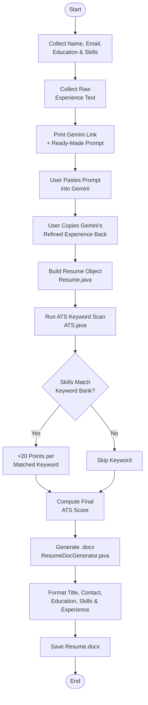

# 📄 Resume Builder — Java + Apache POI

> A command-line resume generation tool that converts structured user input into a polished, ready-to-submit `.docx` resume — with a built-in ATS (Applicant Tracking System) keyword scorer and an AI-assisted experience-writing workflow via Gemini.

---

## ✨ Overview

**Resume Builder** is a lightweight Java application that walks a user through a guided CLI prompt, collects their personal and professional details, optionally enhances their experience summary using **Google Gemini**, scores the resume against common ATS keywords, and generates a clean, formatted **Microsoft Word (.docx)** resume using **Apache POI**.

It's built with a simple goal: make resume creation fast, structured, and keyword-aware — without needing a design tool or a paid resume builder subscription.

---

## 🧩 Core Features

- **Guided CLI Input** — Collects name, email, education, skills, and experience through simple terminal prompts.
- **AI-Assisted Experience Writing** — Generates a ready-to-use Gemini prompt so users can turn a rough experience description into a polished, concise summary, then paste it back into the app.
- **ATS Keyword Scoring** — Scans the user's skill set against a curated keyword list (`Java`, `AI`, `Data`, `Analytics`, `IoT`) and calculates a match score out of 100.
- **Automated DOCX Generation** — Uses Apache POI to build a fully formatted Word document with distinct sections for contact info, education, skills, and experience.
- **Zero External Dependencies for Input** — Runs entirely from the console; no GUI or web server required.

---

## 🏗️ Project Architecture

The project follows a simple, single-responsibility class structure:

```
resume-builder/
│
├── Resume.java              # Data model — holds resume fields (POJO)
├── ATS.java                 # ATS scoring engine — keyword-based match logic
├── ResumeDocGenerator.java  # Document generation — builds the .docx using Apache POI
└── ResumeInput.java         # Entry point — CLI orchestration and user interaction
```

### Class Responsibilities

| Class | Responsibility |
|---|---|
| `Resume` | A plain data model (POJO) storing name, email, education, skills, and experience with standard getters. |
| `ATS` | Calculates a match score by checking whether the user's skills contain any of a predefined keyword set, awarding 20 points per match. |
| `ResumeDocGenerator` | Uses the Apache POI `XWPFDocument` API to construct a Word document, section by section, with titles, bold headers, bullet-style skills, and supporting narrative text. |
| `ResumeInput` | The application's entry point. Handles all `Scanner`-based user input, coordinates the Gemini enhancement step, invokes the ATS scorer, and triggers document generation. |

---

## 🔄 How It Works — Step by Step

1. **User Input Collection**
   The app prompts the user for their name, email, education, skills (comma-separated), and a raw description of their experience.

2. **AI-Enhanced Experience Summary**
   Rather than generating text automatically via an API call, the app prints a ready-made prompt for **Google Gemini** and asks the user to paste their raw experience into it. The user then copies Gemini's refined output back into the terminal — a simple, dependency-free way to bring AI polish into the resume without needing API keys or billing setup.

3. **ATS Score Calculation**
   The `ATS` class checks the user's skill list against a keyword bank (`Java`, `AI`, `Data`, `Analytics`, `IoT`) and returns a cumulative score, giving the user a rough sense of how well their resume might perform against automated recruiter filters.

4. **Document Generation**
   `ResumeDocGenerator` builds the final resume as a `.docx` file using Apache POI, including:
   - A centered, bold title
   - Contact details
   - An education section with a professional closing statement
   - A bulleted skills list
   - An experience section (populated with the Gemini-enhanced text)
   - A closing summary paragraph

5. **Output**
   The final file, `Resume.docx`, is saved to the project's working directory — ready to open, review, and submit.

---

## 🔁 Process Flowchart

The diagram below visualizes the full journey from user input to final document generation:



> GitHub natively renders Mermaid diagrams, so this flowchart will display automatically on your repository's README page.

---

## 🛠️ Tech Stack

| Technology | Purpose |
|---|---|
| **Java** | Core application language |
| **Apache POI (`poi-ooxml`)** | Programmatic `.docx` file generation |
| **Google Gemini** (manual workflow) | AI-assisted experience text refinement |
| **Java Scanner API** | Command-line user input handling |

---

## 🚀 Getting Started

### Prerequisites
- JDK 8 or higher
- [Apache POI](https://poi.apache.org/download.html) libraries (`poi`, `poi-ooxml`, and their dependencies) on your classpath

### Setup

1. Clone the repository:
   ```bash
   git clone https://github.com/<your-username>/resume-builder.git
   cd resume-builder
   ```

2. Add the Apache POI JARs to your classpath (or manage them via Maven/Gradle — see [Roadmap](#-roadmap) below).

3. Compile the project:
   ```bash
   javac -cp ".:lib/*" *.java
   ```

4. Run the application:
   ```bash
   java -cp ".:lib/*" ResumeInput
   ```

5. Follow the on-screen prompts. When asked, visit the printed Gemini link, paste the suggested prompt, copy Gemini's response back into the terminal, and let the app generate your resume.

6. Open the generated `Resume.docx` in the project directory.

> 💡 On Windows, replace `:` with `;` in the classpath commands above.

---

## 📌 Example Run

```
Enter your name:
> Soumen Das
Enter your email:
> soumen@example.com
Enter your education:
> B.Tech in Electronics and Communication Engineering, IEM Kolkata
Enter your skills (comma separated):
> Java, Spring Boot, Data Structures, AI
Enter your experience:
> Built microservices projects using Java and Kafka

To enhance your experience section, please visit:
   https://gemini.google.com/app?hl=en-IN
Copy and paste this line into Gemini:
   In a single short para in 25 words generate my experience for Resume Built microservices projects using Java and Kafka
Then copy the generated text from Gemini and paste it here:
> Developed scalable microservices using Java and Kafka, strengthening backend architecture skills and hands-on experience with distributed, event-driven systems.

Resume.docx created
```

---

## 🗺️ Roadmap

Planned improvements to evolve this from a CLI utility into a more complete tool:

- [ ] Migrate to **Maven/Gradle** for automated dependency management
- [ ] Replace the manual Gemini copy-paste flow with a direct **Gemini/Claude API integration**
- [ ] Expand the ATS keyword bank and make it configurable via a JSON/YAML file
- [ ] Surface the ATS score directly in the generated document (currently calculated but not yet rendered)
- [ ] Add resume **templates** (multiple visual styles/themes)
- [ ] Build a simple **web or desktop UI** on top of the existing core logic
- [ ] Add unit tests for `ATS` scoring logic

---

## 🤝 Contributing

Contributions, issues, and feature requests are welcome! Feel free to check the [issues page](../../issues) or open a pull request.

---

## 📄 License

This project is open-source and available under the [MIT License](LICENSE).

---

## 👤 Author

**Soumen Laha**
B.Tech in Electronics and Communication Engineering, IEM Kolkata (MAKAUT) | Aspiring SDE

[](https://github.com/Soumen827)
[](https://leetcode.com/HuH3msfXNp)

---

<p align="center">⭐ If you found this project useful, consider giving it a star!</p>

---

<p align="center">⭐ If you found this project useful, consider giving it a star!</p>
